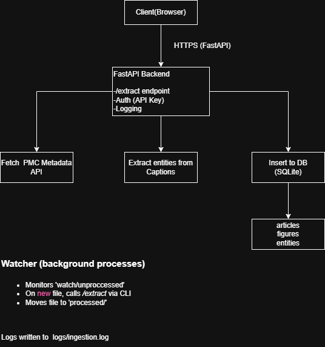

### Key Components and Their Interactions

- This system is built with a modular architecture, enabling clean separation of responsibilities and extensibility for future enhancements. The core components and how they interact are described below:

- FastAPI Application (main.py): Exposes an /extract endpoint that accepts a list of PMC IDs, verifies API access, and orchestrates the data retrieval and processing pipeline.

- PMC Fetcher (pmc.py): Acts as the data source module. For each provided ID, it fetches article metadata (title, abstract) and associated figure captions from the PMC Open Access API.

- Entity Extractor (extract_entity_from_caption): Parses the text content of each figure caption to extract relevant entities or keywords. This step currently uses a simple pattern-based method but can be replaced with an advanced NLP pipeline later.

- Database Layer (db.py): Handles initialization and interaction with the SQLite database. All extracted metadata and figures are inserted into respective tables (articles, figures) for persistent storage.

- CLI Tool (cli.py): Provides a command-line interface for ingesting data in batch mode. It supports submitting PMC IDs via a file, manual input, or by monitoring a specific folder for incoming .txt files containing IDs.

- Watcher Service: A lightweight folder-watching daemon that automatically detects new ID files in the watch_dir/unprocessed/ folder, triggers ingestion, and moves them to processed/ after completion.

- Logging Module: Logs all events related to ingestion, processing errors, and successful extractions to logs/ingestion.log, supporting traceability and debugging.

- Dockerized Environment: The entire system is containerized for easy deployment. The Docker image exposes the FastAPI service on port 8000, and the watcher can run as a separate service if needed.

- Each component is designed to be loosely coupled and easily replaceable. For instance, the data source module (pmc.py) can be swapped with additional sources in the future by registering them under a standard fetcher interface.

### 📦 Dependencies and Justifications

- **FastAPI** – High-performance web framework perfect for async APIs.
- **SQLite** – Lightweight, file-based DB ideal for small-to-medium data and local setups. Can be replaced later with PostgreSQL if needed.
- **Uvicorn** – ASGI server for serving FastAPI apps.
- **requests** – For calling external PMC and PubTator APIs.
- **Docker** – Ensures consistent deployment across machines.

### Deployment Diagram

### Testing and Implementation

1. Phased Implementation Approach
   The system was developed and tested in multiple logical phases to ensure modularity, testability, and easier debugging:

- Phase 1: Core API Functionality
  Built the FastAPI server, defined the /extract route, and implemented logic for fetching article metadata and figure captions from PMC.

- Phase 2: Entity Extraction & Data Structuring
  Developed a simple keyword/entity extraction function for captions. Ensured that the response structure included all key components: title, abstract, figures, and extracted entities.

- Phase 3: Database Integration
  Added SQLite (previously DuckDB) as a persistent backend to store the metadata. Wrote schema logic and functions to insert article and figure data.

- Phase 4: CLI + Watcher Development
  Built the CLI tool for ingestion jobs and a folder-watching service to support automation. Files in watch_dir/unprocessed/ are picked up, ingested, and moved to processed/.

- Phase 5: Logging & Graceful Shutdown
  Added logs/ingestion.log to store summaries, errors, and status. Used atexit and signal to ensure clean exits of the watcher.

- Phase 6: Dockerization
  Created a lightweight Dockerfile for containerized deployment. Verified API and watcher service inside Docker.

2. Testing Strategy

- A. Functionality Testing

* Verify /extract with multiple valid and invalid PMC IDs.

* Confirm correct structure of returned JSON (title, abstract, figures, entities).

* Insert articles into DB and cross-checked via SQLite shell queries.

* Run the CLI and watched folder with different input formats (.txt, whitespace/newline-separated IDs).

- B. Security Testing (API Key)

* Test valid and invalid API keys.

* Confirm that requests without a key or with the wrong key return HTTP 403.

* Ensure API key is passed via X-API-Key header (not URL or body).

- C. Performance Testing

* Run batch jobs with small (3–5), medium (10–20), and large (50+) ID lists.

* Measure response times and made sure they didn’t exceed timeout thresholds.

* Verify that DB writes don't cause a bottleneck by testing parallel ingestion attempts.

- D. Mocked vs Real Data

* Mocked Data:
  Used local JSON files to simulate PMC API responses while testing database logic, CLI, and caption parsing in isolation.

* Real Data:
  Queried actual PMC IDs (see test list below) to verify complete end-to-end system behavior.
